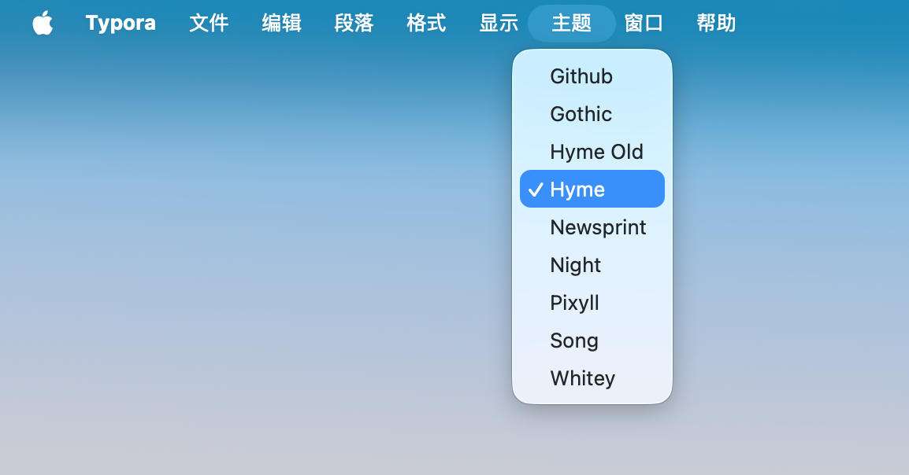
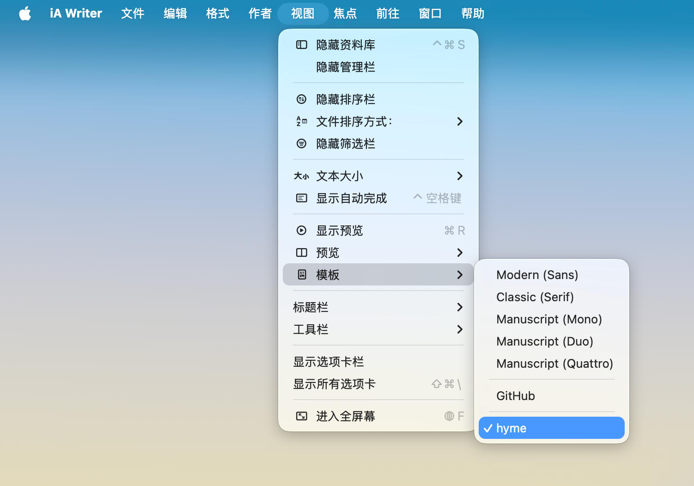
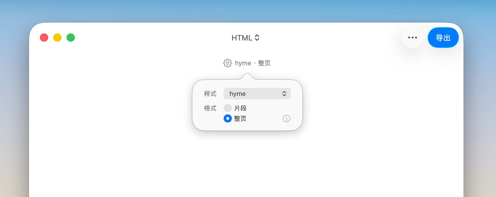

# 公众号「黄杨ME」的排版样式主题

目前提供 Typora, Ulysses 和 iA Writer 版本下载。

## 🛠 安装和使用

### Typora

1. 打开 Typora 偏好设置 -> 外观 -> 打开主题文件夹（在 macOS 中一般是 `~/Library/Application Support/abnerworks.Typora/themes`）。
2. 将主题文件 [hyme.css](hyme.css) 放入该文件夹。
3. 重启 Typora，在菜单栏「主题」中选择 `Hyme`即可使用主题。



- Typora 提供的 [Write Custom Typora Theme](https://theme.typora.io/doc/zh/Write-Custom-Theme/)。
- Typora 官方提供的更多主题：[https://theme.typora.io](https://theme.typora.io)。

### iA Writer

1. 双击下载的 [hyme-ai-writer.iatemplate](hyme-ai-writer.iatemplate) 主题文件即可完成安装。
2. 在菜单栏「视图」-「模版」中选择「hyme」即可使用主题。
3. 在软件设置「模版」下的「自定义模版」列表中也可以看到安装的主题，或卸载某个主题。



- iA Writer 提供的 [iA Writer Templates](https://github.com/iainc/iA-Writer-Templates)。
- iA Writer 官方提供的更多主题：[https://ia.net/downloads](https://ia.net/downloads)。

### Ulysses

  1. 双击 [hyme.ulstyle](hyme.ulstyle) 即可完成安装。
  2. 进入 Ulysses 导出视图，类型选 HTML，样式选`hyme`。



- Ulysses 官方提供的 [How to customize Ulysses](https://styles.ulysses.app/learn)。
- Ulysses 官方提供的更多主题：[https://styles.ulysses.app/styles/](https://styles.ulysses.app/styles/)。

## 在图片下方显示「图注（Caption）」

当给图片加 alt，也就是 markdown 图片语法中`[]`里的描述内容，iA Writer 和 Ulysses 会解析成 figcaption，主题会把图注显示为一行居中小字。

```markdown

```


但 Typora 不予处理，所以 Typora 可以手动在紧跟图片后用 `<small>` 标签，例如：

```markdown

<small>猫咪</small>
```

## 📄 License
[MIT](LICENSE) © Huang Yang
